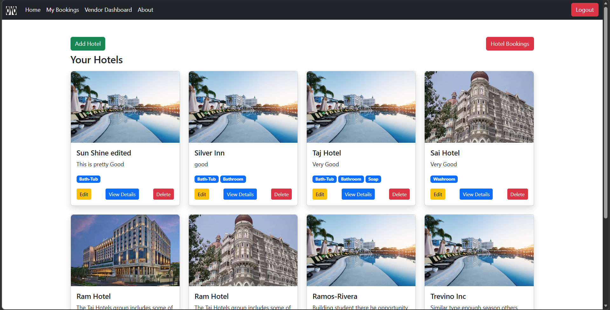
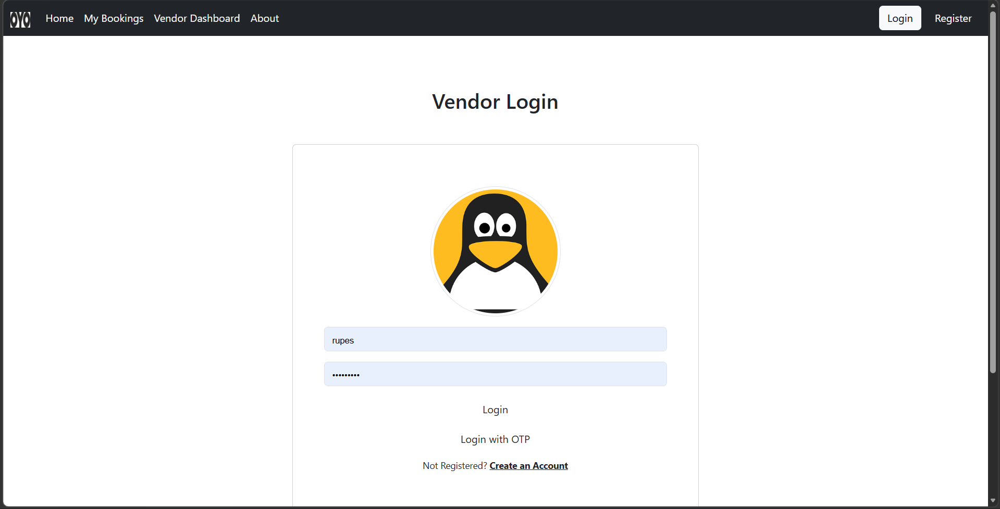

# OYO Clone - Django Hotel Booking System

A full stack hotel booking web application inspired by OYO, built using Django.  
Users can browse hotels, view details, and book rooms while vendors can manage their hotel listings.

---

## Features

### User Features
- User Registration and Login
- Email Verification
- OTP Login System
- Browse Hotels
- View Hotel Details
- Book Hotel Rooms
- Cancel Booking
- View Booking History

### Vendor Features
- Vendor Registration
- Vendor Login (Password and OTP based login)
- Vendor Profile with Photo Upload
- Add Hotel Listings
- Edit Hotel Details
- Delete Hotel Listings
- View All Hotel Bookings
- Manage Hotel Availability

### System Features
- Hotel listing with amenities
- Pagination for hotel list
- Image upload for hotels
- Django caching for performance optimization
- Secure environment variables using `.env`
- Django Admin Panel

---

## Tech Stack

Backend:
- Python
- Django

Frontend:
- HTML
- CSS
- Bootstrap

Database:
- SQLite (Development)

Tools:
- Git
- GitHub

---

## Project Structure
oyo_clone
│
├── accounts
├── home
├── templates
├── static
├── media
├── manage.py
└── README.md

---

---

## Screenshots

### Home Page

### Vendor Dashboard

### Vendor Login Page

---

## Future Improvements

- Payment Gateway Integration
- Hotel Reviews
- Advanced Search Filters
- Redis Caching
- Deployment on cloud

---

## Author

Rupesh Pradhan